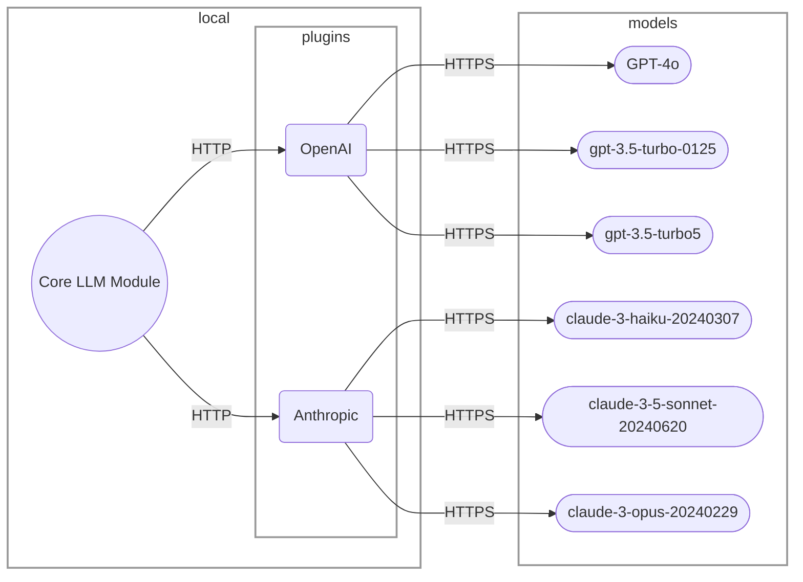

# Architecture.md

The Core LLM Module is installed first. This is the module that a user directly interacts with on the command line. Plugins can be installed allowing a user to interface with specific models. Plugins are installed through the Core LLM Module

